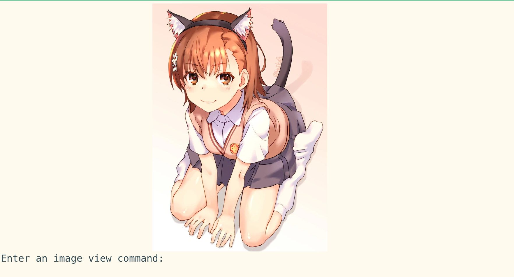

# koneko [](https://www.gnu.org/licenses/gpl-3.0.txt) [](https://github.com/psf/black) []

Browse pixiv in the terminal using kitty's icat to display images (in the terminal!)




Requires [kitty](https://github.com/kovidgoyal/kitty) on Linux. It uses the magical `kitty +kitten icat` 'kitten' to display images. For more info see the [kitty documentation](https://sw.kovidgoyal.net/kitty/kittens/icat.html). Actually, `lscat.py` uses [pixcat](https://github.com/mirukana/pixcat), which is a Python API for icat.

**Why the name Koneko?** Koneko (こねこ) means kitten, which is icat is, a kitty +kitten

**This is still in alpha stages**. Once I finally ~~get async working~~ and ~~rewrite lscat~~ and refactor+stabilize it will be in beta (see [milestones](https://github.com/twenty5151/koneko/milestone/1)). All PRs are welcome. The current master branch is (supposed to be) stable, but it's still alpha. The `testing` branch is for the latest features, fixes, and super instability. It is merged with the `dev` branch nightly (or less frequently). In turn, `dev` is merge with `master` the next day, so essentially `master` is just `testing` delayed by two days.


# Features
* Artist illustration gallery (equivalent to the illustrations tab on the artist's profile)
    * Enter a number to open a post, or its coordinates in the form `x,y` (no brackets needed) or `x y` (separate with a space)
    * 1 <= x <= 7 and 1 <= y <= 5. Note that y (rows) counts from top to bottom. For example, 5,1 means col 5 row 1 == picture 4. See [testing.py](testing.py)
* Image view: view an image in large resolution
* Image view can also browse through different images in a multi-image post.
* Both gallery and image views can:
    * Download a post ([PixivUtil](https://github.com/Nandaka/PixivUtil2/) would be more suitable for batch download)
    * Open post in browser


# Rationale
* Terminal user interfaces are minimalist, fast, and doesn't load Javascript that slows down your entire browser or track you
    * Image loading is *so* much faster

I get 32 trackers on Pixiv. Plus, you have to disable ublock if you ever get logged out

<a href="url"></a>

* TUIs make you cool
* TUIs *with embedded pictures* make you even cooler
* TUIs embedded with pictures of cute anime girls make you the coolest
* Keyboard driven
* I use arch btw


# Usage
0. Install [kitty](https://github.com/kovidgoyal/kitty), and all other requirements (just see list of imports)
    * [pixivpy](https://github.com/upbit/pixivpy): `pip install pixivpy`
    * [pixcat](https://github.com/mirukana/pixcat): `pip install pixcat`
1. `mkdir ~/.config/koneko/ && touch ~/.config/koneko/config.ini`
2. `vim ~/.config/koneko/config.ini` and fill it out with your pixiv username and password like this:

```ini
[Credentials]
Username = XXX
Password = XXX
```

3. Run:
```sh
git clone https://github.com/twenty5151/koneko.git && cd koneko
python koneko.py
```

4. As of now there are two modes of operation:
    1. Show artist illustrations: equivalent to going to the artist page in pixie
    2. View post: equivalent to going directly to a post (think getting a 'sauce' link)
Enter either 1 or 2 to proceed. Then, paste in the corresponding pixiv url. See below for url examples. Pressing ctrl+c in a prompt bring you back to the 'home' prompt.

Alternatively, you can supply a pixiv url as a command line argument to `koneko.py`, bypassing the first interactive prompt. The pixiv url must be either the url of the artist's page, or a pixiv post. Example:

```sh
python koneko.py https://www.pixiv.net/en/users/2232374

python koneko.py https://www.pixiv.net/en/artworks/78823485
```

## lscat rewrite

**Note on terminology**: [lsix](https://github.com/hackerb9/lsix/) is the name of the original shell script I used, which uses libsixel. I edited it to use icat and renamed it **lscat**. Then I rewrote it with python, which is named **lscat.py**.

You might have problems with image positioning with lscat.py. I wrote it to fit my screen and my terminal size, so there are 'magic numbers' (numbers that just exist) around. There's also no functionality to adjust for different terminal sizes. You can do either:

1. Adjust the 'magic numbers'. There are around 4-5 types and they are commented in `lscat.py`
2. You can revert to the old lscat script. In `show_artist_illusts()`, uncomment the two lines and comment out `lscat(path)`
3. You can contribute by checking terminal size and doing all the maths. Send a PR! The only requirement is that it has to be *fast*. If not, it should be have a toggle to skip those checks.
4. You can even use libsixel with lsix. In that case, replace the `lscat` file with [lsix](https://github.com/hackerb9/lsix/) and then do 2.


## `Dev` branch

Use the `dev` branch for latest features/fixes that will be merged to `master` soon:

```sh
git clone -b dev https://github.com/twenty5151/koneko.git
```

## Unit tests
Use `pytest testing.py`


Here's a random shell command to get (but not download) and display any pixiv image url:
```sh
curl -e 'https://www.pixiv.net' "https://i.pximg.net/img-original/img/2019/12/21/20/13/12/78403815_p0.jpg" | kitty +kitten icat --align left --place 800x480@0x5
```
